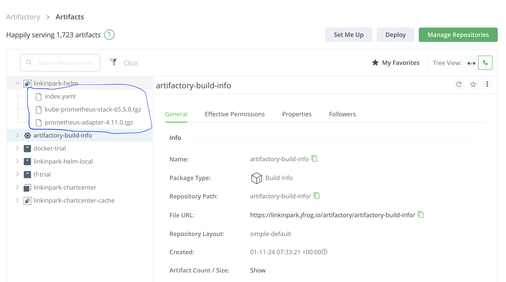

# Automated Helm Chart Upload to S3 and JFrog Artifactory

helm-chart

Feature:

1. Load charts from base directory (Done)

2. Update dependency based on Chart.yaml (Done)

3. Build dependency based on Chart.yaml (Done)

4. Lint (Basic Lint checking) (Done)

5. Package (generate index file) (Done)

6. Push into Jfrog (Done)

7. Push into S3

8. Use github pipeline

ToDo:

A. 2 and 3 remotely by searching repo links

B. Write testing for each function

C. Helm lint (Done)

D. Use digest, s3Url, build version in MustAdd method of index (Done)

E. Refactor following functionalities
1. Download index file
2. Load chart
3. processChart
4. Update Dependency
5. Lint
6. package
7. Write into indexfile
8. Upload to Jfrog and s3
9. Validation (after packaging)
10. Multiplex using goroutines to speedup
11. Testing

How to execute:
1. go mod tidy
3. go run main.go