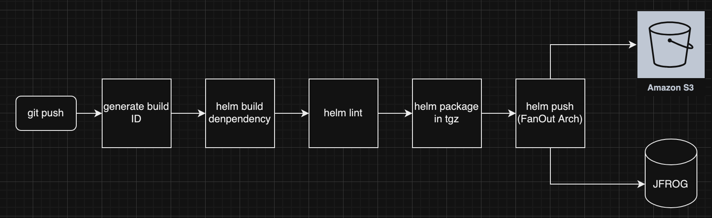

# Automated Helm Chart Deployment to S3 and JFrog Artifactory with Vulnerability Scanning

helm-chart

Feature:

1. Load charts from base directory (Done)

2. Update dependency based on Chart.yaml (Locally for now) (Done)

3. Build dependency based on Chart.yaml (Locally for now) (Done)

4. Lint

5. Package (generate index file)

6. Push into Jfrog

7. Push into S3

8. Test helm chart in github pipeline

ToDo:

A. 2 and 3 remotely by searching repo links

B. Write testing for each function